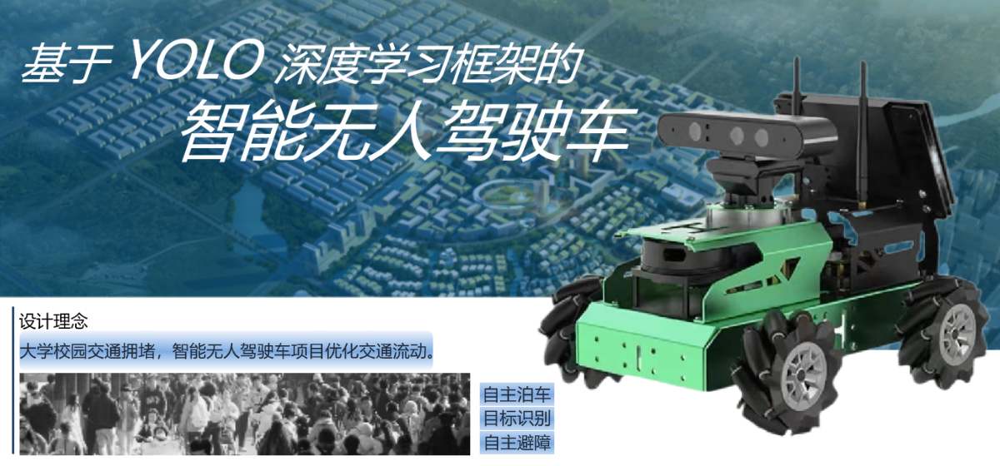
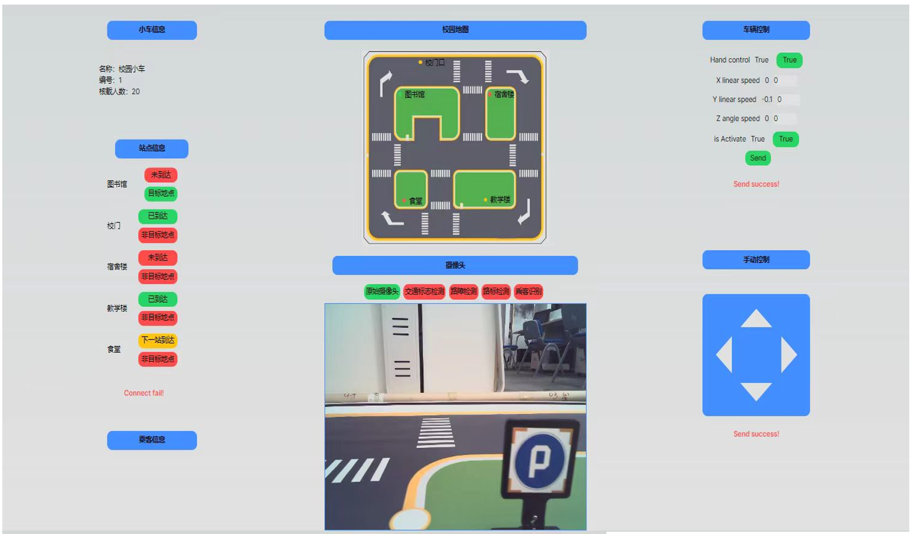

<div align="center">

# Cool Car Frontend


</div>



## 项目简介

本项目是基于YOLO深度学习框架的智能无人驾驶校园巴士的前端部分，主要功能包括：
- 实时获取校园巴士摄像头信息
- 实时获取站点信息
- 实时监控校园巴士的位置
- 实时监控校园巴士的载客情况
- 远程手动控制校园巴士



## 项目特点

开发笔记: [React NextJS App Router 实时获取API](https://shenyifan.home.blog/2024/06/19/react-nextjs-app-router-实时获取api/)

校园巴士上使用Flask框架搭建一个API服务器，通过API获取校园巴士的数据并且发送控制信号。

本项目前端主要是在NextJS框架下使用React开发，在实现基本功能的同时，在面对需要实时获取数据的情况，我没有使用其他第三方库来实现API获取，而是根据[NextJS官网](https://nextjs.org/docs/app/building-your-application/data-fetching/fetching-caching-and-revalidating)来实现`data-fetching`。

最终，经过各种排列组合的尝试之后，我得出了一个合理的解决方案，就是在`useEffect`中调用`getLocationInformation()`，并且在获取后端API的代码中加入`next: {revalidate: 0}`，代码如下：
``` js
// 获取后端API的代码
export async function GET(request: NextRequest) {
    const res = await fetch(URL + '/api/information', {
        headers: {
            'Content-Type': 'application/json',
        },
        next: {revalidate: 0} // 0秒后重新获取数据
    })
    const data = await res.json()
    // return Response.json({ data })
    return NextResponse.json({ data })
}

// 调用本地API的代码
useEffect(() => {
        getLocationInformation();
    });

async function getLocationInformation() {
    const res = await fetch('/api/getLocationInformation');
    if (!res.ok) {
        setMessage("Connect fail!");
        return;
    }
    const data = await res.json();
    setLocationInformation(data.data);
    setRootLocationInformation(data.data);
    for (var _ in data.data) {
        if (data.data[_]["is_arrived"]) setIsNextLocation(LocationInformationLinkedList[_ as keyof TypeLocationInformationLinkedList])
    }
    console.log(locationInformation)
}
```
我个人的理解是，`next: {revalidate: 0}`是在获取数据的时候，告诉NextJS在0秒后重新获取数据，这样就可以实现实时获取数据了，同时由于`useEffect`函数的使用，使得后端每次获取新的API，这里就可以实时在页面上更新，也算是一个不错的解决方案吧。

## 总结
本项目成功实现在NextJS框架下用React实现实时与后端API通信，同时也解决了实时获取数据的问题，在未来有类型的项目中，可以基于本项目进行拓展。
